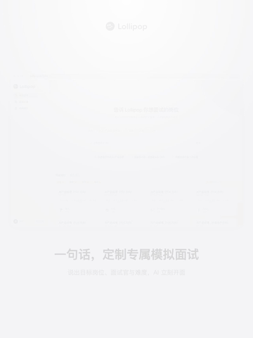
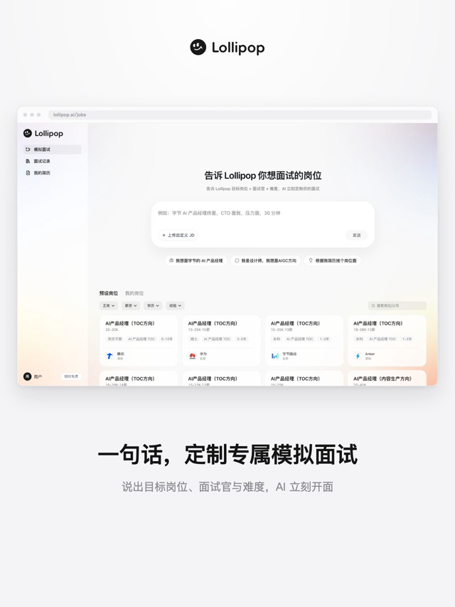
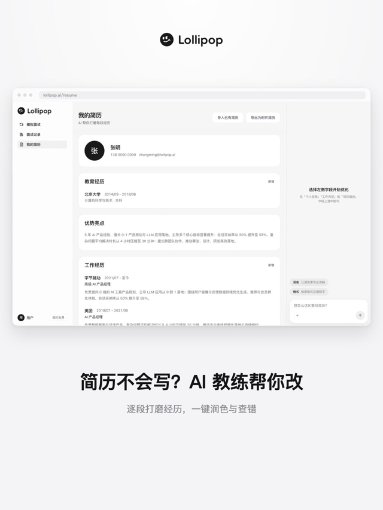
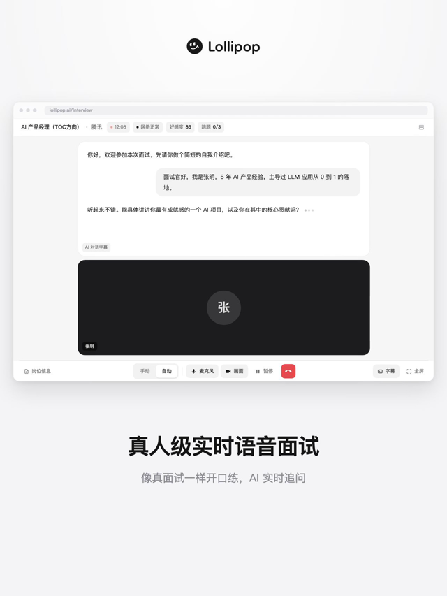
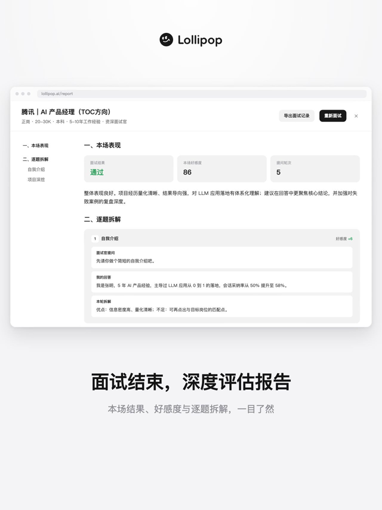

# product-demo-video

> A [Claude Code](https://claude.com/claude-code) skill that turns a real web product into a polished, on-brand demo video — powered by [Remotion](https://remotion.dev).
>
> 一个 Claude Code 技能：把真实 web 产品的页面，自动做成有调性的产品演示短片。

<p align="center">
  
  
  
</p>

<p align="center">
  
</p>

## 这是什么

一个能**自己读懂你的 web 应用**的 skill。你只给一个能跑起来的项目，对 Claude 说「给我的产品做个演示视频」，它会**自动看你的代码、生成文案、找到你的 logo**，然后端到端做出片子：

1. **自动理解产品**：读 `CLAUDE.md` / `README` / 路由，搞清每个页面是干什么的、产品的调性
2. 启动项目、处理登录，用浏览器**截真实页面**
3. 截不到的页面（实时交互 / 依赖特殊数据）→ **读真实组件代码 1:1 重建**，不靠想象
4. **自动为每个页面生成字幕文案**，组装成浏览器窗口 mockup 的短片：场景转场 + Ken Burns 运镜 + 字幕 + 你的真实 logo
5. 配免版权 BGM，或真人级 TTS 旁白，渲染输出

全程遵守一套**固化的设计调性**，产出不像模板、有质感的片子。

## 效果

下面是用它给一个**示例 web 应用**生成的演示片画面——真实截图与代码重建的界面，在同一套浏览器 mockup 里无缝衔接：

|  真实页面截图  |  真实页面截图  |
| :---: | :---: |
|  |  |
|  **代码重建界面**  |  **代码重建界面**  |
|  |  |

完整视频：[`assets/demo.mp4`](assets/demo.mp4)（1280×1706 · 12s · 含背景音乐）

> 「真实截图」直接来自产品页面；「代码重建」是因为有些页面截不到真实图（实时交互页缺设备、结果页依赖后端），于是 Claude **读真实组件代码 1:1 还原**。

## 特性

- **自动读代码**：理解每个页面的功能，自动生成对应的场景字幕文案、自动定位项目真实 logo
- **真实页面 → 视频**：用 [agent-browser](https://github.com/agent-browser/agent-browser) 自动截图，不用假数据
- **截不到就照代码重建**：读真实组件，1:1 还原界面，杜绝凭想象画
- **固化调性**：配色 / 字体 / 缓动 / 节奏 / 字幕写成规范 + 反面清单，稳定复现质感
- **配音可选**：Mixkit 免版权 BGM，或 OpenAI 兼容真人级 TTS 旁白
- **多比例**：竖版 1280×1706 / 方版 1080×1080 / 横版 1920×1080

## 安装

把仓库克隆进 Claude Code 的 skills 目录：

```bash
git clone https://github.com/realruian/product-demo-video.git ~/.claude/skills/product-demo-video
```

重启 Claude Code，它会自动出现在技能列表里。

### 依赖

- **remotion-best-practices**（视频框架）：`npx skills add remotion-dev/skills`
- **agent-browser**（截图）：`npm i -g agent-browser && agent-browser install`
- 渲染机建议 **macOS**（字体用 PingFang）
- 可选：TTS 需要 OpenAI 兼容的 API key

## 使用

对 Claude Code 说，例如：

> 给我们的产品做个竖屏演示视频

Claude 会加载本 skill 的流程，先读懂你的产品、跟你确认 **画布比例 / 纳入哪些页面 / 节奏 / 声音方案**，再端到端做出来。`templates/` 里留了一份中性占位示例，Claude 会按你的真实项目自动覆盖。

## 结构

```
SKILL.md              主说明书（流程 + 调性 + 踩坑教训）
reference/tone.md     调性规范详述（配色 / 字体 / 缓动 / 节奏 / 反面清单）
templates/
  PromoVideo.tsx      浏览器 mockup + 场景编排 + 字幕 + Outro + 音频（占位骨架）
  PromoRoot.tsx       Remotion composition 注册
  screens/            「照真实代码重建界面」范例（会话型 / 报告型）
scripts/
  capture-pages.md    agent-browser 登录截图全流程
  gen-tts.sh          真人 TTS 旁白生成
  get-bgm.sh          Mixkit 免版权 BGM 下载试听
```

## 调性（灵魂所在）

这套调性是「高质感、不像 AI」的关键，详见 [`reference/tone.md`](reference/tone.md)：白底黑白灰、PingFang、灰点浏览器 mockup、统一缓动与节奏、真实矢量 logo、无 emoji，以及一份「出现即降级为 AI 味」的反面清单。优先遵守目标项目自己的 `DESIGN.md`。

## License

[MIT](LICENSE) © realruian

演示素材取自一个示例 web 应用，仅用于展示本 skill 的效果。
